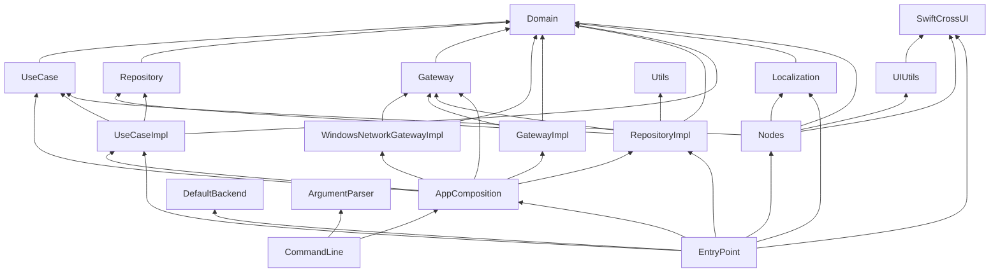
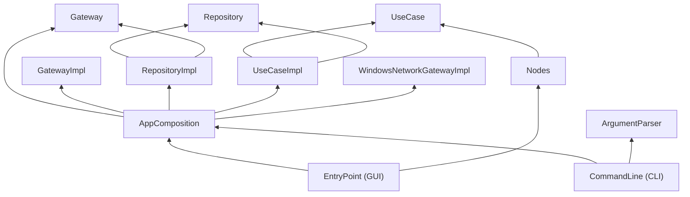

# Architecture

## Purpose

Windows Connection Order uses separate Swift Package targets to keep the user interface, application logic, cached state, and platform APIs independent. Dependencies always point inward: UI code calls use-case contracts; use cases call repository contracts; repositories call gateway contracts.

`Domain` is the shared foundation. It contains application value types only and does not import another project target.

## Current target graph

An arrow means "depends on".



## Targets

| Target | Responsibility |
| --- | --- |
| `Domain` | Platform-independent values: adapters, LUID-based IDs, IP address/configuration types, app locale, color scheme, and navigation destinations. |
| `Gateway` | Protocols for external sources. `AdaptersGateway` is the adapter-discovery boundary. |
| `GatewayImpl` | Cross-platform implementations. It currently provides `MockAdaptersGateway` for previews, tests, and non-Windows platforms. |
| `WindowsNetworkGatewayImpl` | Windows-only implementation of `AdaptersGateway`, isolated behind `Gateway`. |
| `Repository` | Contracts for cached state and state streams. |
| `RepositoryImpl` | Actor-backed repository implementations. They cache values and expose `AsyncStream` updates through `AsyncCurrentValue`. |
| `UseCase` | Application action contracts consumed by UI or command-line code. |
| `UseCaseImpl` | Implementations of refreshing, streaming, reordering, metric updates, locale changes, and color-scheme changes. |
| `AppComposition` | Creates the adapter repository and adapter use cases for GUI and CLI. It chooses the system or mock gateway. |
| `Localization` | `Localizables`, `.strings` resources, and generated typed accessors. It depends only on `Domain`. |
| `UIUtils` | Reusable SwiftCrossUI components and UI-only helpers. It must not depend on `Domain`, localization, or feature nodes. |
| `Nodes` | Feature screens, views, view models, and their dependencies. Nodes depend on contracts, not implementations. |
| `Utils` | Small cross-cutting concurrency utilities, currently `AsyncCurrentValue`. |
| `EntryPoint` | GUI executable. It composes GUI-only locale, theme, navigation, and screen dependencies. |
| `CommandLine` | CLI executable. It provides read-only adapter listing in table or JSON form. |

## Dependency rules

- Gateways do not own application cache state.
- Repositories own cached state and publish it; they do not expose a generic public cache-replacement operation.
- Use cases express explicit operations such as `refreshAdapters`, `reorderAdapters`, and `updateAdapterMetric`.
- Nodes do not access repositories, gateways, or concrete use-case implementations.
- `Localization` is used only by `Nodes` and `EntryPoint`; the lower layers use `AppLocale` from `Domain`.
- Composition passes protocol existentials such as `any AdaptersGateway`; application dependency wiring must not use generic type parameters.

## Adapter data flow

```text
MainScreen -> MainViewModel -> UseCase -> Repository -> Gateway
```

1. A refresh use case asks `AdaptersRepository` for fresh adapters.
2. The repository fetches them through `AdaptersGateway` and updates its actor-isolated cache.
3. `AsyncCurrentValue` publishes the current adapter array to all `streamAdapters()` subscribers.
4. The view model receives the new value and updates its observable screen state.

Reordering and metric editing currently update the repository's in-memory state. This is intentionally separate from future Windows write operations.

## Windows gateway status

`WindowsNetworkGatewayImpl` currently reads real Windows adapter information with `GetAdaptersAddresses`:

- friendly adapter name;
- interface LUID;
- IPv4 and IPv6 interface metrics;
- first available unicast IPv4 and IPv6 addresses.

It uses `WSAAddressToStringW` to turn native socket addresses into the domain IP value types. An interface without an address is represented as missing data, not as a fabricated `0.0.0.0` or `::` value.

Writing interface metrics to Windows is **not implemented yet**. The required next boundary is a gateway operation backed by `GetIpInterfaceEntry` and `SetIpInterfaceEntry`, including the explicit handling of automatic metrics. Real-time change notifications are also not implemented; they will use Windows IP-interface and unicast-address notifications to trigger a repository refresh.

## Composition and command-line targets

Two executable-facing targets share the adapter feature:

| Target | Responsibility |
| --- | --- |
| `AppComposition` | Builds the adapter repository and associated use-case implementations. It exposes system and mock factories returning protocol existentials. |
| `CommandLine` | A separate `WindowsConnectionOrderCLI` executable. It consumes the same adapter use cases as the GUI and does not depend on SwiftCrossUI, `Nodes`, or `Localization`. |

The GUI and CLI share use-case construction through `AppComposition`:



`AppComposition` holds the platform selection and creates repositories with `any AdaptersGateway`. It returns `any` use-case contracts, giving GUI and CLI identical behavior: the real gateway on Windows and the existing mock fallback elsewhere.

The first CLI surface is read-only adapter listing, with human-readable table and JSON output. Mutating CLI commands should remain clearly marked as in-memory simulation until the Windows metric writer exists.
