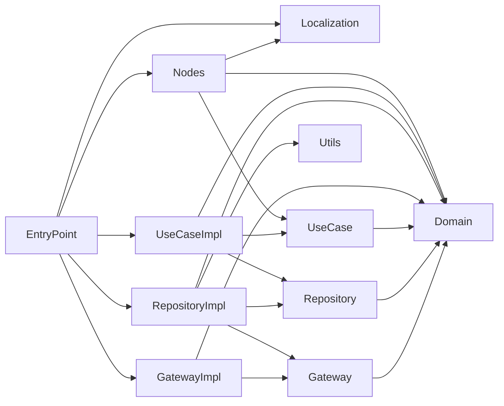

# Architecture

## Overview

Windows Connection Order is split into Swift Package targets so that UI, application logic, caching, and platform access remain isolated.



An arrow means “depends on”. `EntryPoint` is the composition root and is the only target allowed to instantiate concrete implementations.

## Targets

| Target | Responsibility |
| --- | --- |
| `Domain` | Value types such as `NetworkAdapter`, `IPv4Address`, `IPv6Address`, and their configurations. It has no application-layer dependencies. |
| `Gateway` | Protocols for external data sources. |
| `GatewayImpl` | Implementations of gateway protocols. `MockAdaptersGateway` is the current demo source; a Windows API implementation belongs here later. |
| `Repository` | Protocols for cached application data. |
| `RepositoryImpl` | Repository implementations. `AdaptersRepositoryImpl` reads from a gateway, owns the adapter cache, and publishes cache changes. |
| `UseCase` | Protocols consumed by UI nodes. |
| `UseCaseImpl` | Application actions such as streaming, refreshing, and reordering adapters. |
| `Nodes` | SwiftCrossUI views and their view models. The current screen is `Nodes/Main`. |
| `Localization` | `AppLocale`, resource bundles, and generated typed localization accessors. |
| `Utils` | Small reusable concurrency utilities, currently `AsyncCurrentValue`. |
| `EntryPoint` | Executable target and composition root. It wires every concrete dependency together. |

## Data flow

```text
MainNode → MainViewModel → UseCase → Repository → Gateway
```

1. `MainViewModel` starts `StreamAdaptersUseCase` and receives an `AsyncStream<[NetworkAdapter]>`.
2. `RefreshAdaptersUseCase` asks the repository to fetch fresh values through `AdaptersGateway`.
3. The repository puts the result into its cache.
4. Every stream subscriber receives the new cached value; the view model updates its observable UI state.
5. A reorder action follows the same path through `ReorderAdaptersUseCase`. The repository changes its own cache and publishes the update.

`Gateway` implementations must not own application cache state. `Repository` implementations must not expose a generic public “replace cache” operation: mutations are represented by explicit operations such as `reorderAdapters`.

## AsyncCurrentValue

`Utils/AsyncCurrentValue` provides `CurrentValueSubject`-like semantics using Swift Concurrency:

- `current()` returns the latest value.
- `update(_:)` replaces it and emits the value to all subscribers.
- `stream()` immediately yields the current value to a new subscriber, then yields future updates.

It is an `actor`, so its cache and subscriber continuations are isolated from data races.

## Dependency injection

The project intentionally avoids `any` for application dependencies. Concrete implementations are connected in `EntryPoint` through generic types:

```text
MockAdaptersGateway
  → AdaptersRepositoryImpl<MockAdaptersGateway>
  → StreamAdaptersUseCaseImpl<...>
  → MainViewModel<MainDependencies<...>>
```

Views depend on UseCase protocols through generic constraints, not on repository or gateway implementations.

## Localization

Translations live in `Sources/Localization/Resources/<language>.lproj/<Table>.strings`.

`scripts/Generate-Localizables.ps1` validates every localization table and generates typed accessors into `Sources/Localization/Generated/`. That directory is intentionally ignored by Git. Build scripts run the generator before compiling, so a clean checkout should use the provided scripts rather than a direct `swift build` command.
